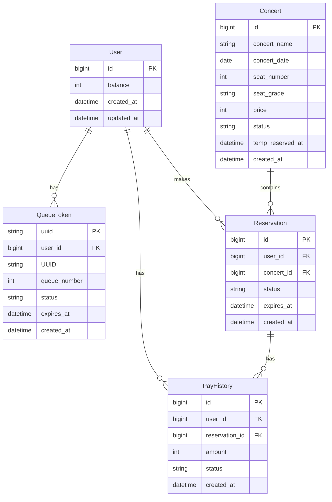

# 콘서트 예약 시스템 ERD

```mermaid
erDiagram
    User ||--o{ QueueToken : has
    User ||--o{ Reservation : makes
    User ||--o{ PayHistory : has
    Concert ||--o{ Reservation : contains
    Reservation ||--o{ PayHistory : has

    User {
        bigint id PK
        int balance
        datetime created_at
        datetime updated_at
    }

    QueueToken {
        string uuid PK
        bigint user_id FK
        string UUID
        int queue_number
        string status
        datetime expires_at
        datetime created_at
    }

    Concert {
        bigint id PK
        string concert_name
        date concert_date
        int seat_number
        string seat_grade
        int price
        string status
        datetime temp_reserved_at
        datetime created_at
    }

    Reservation {
        bigint id PK
        bigint user_id FK
        bigint concert_id FK
        string status
        datetime expires_at
        datetime created_at
    }

    PayHistory {
        bigint id PK
        bigint user_id FK
        bigint reservation_id FK
        int amount
        string status
        datetime created_at
    }
```