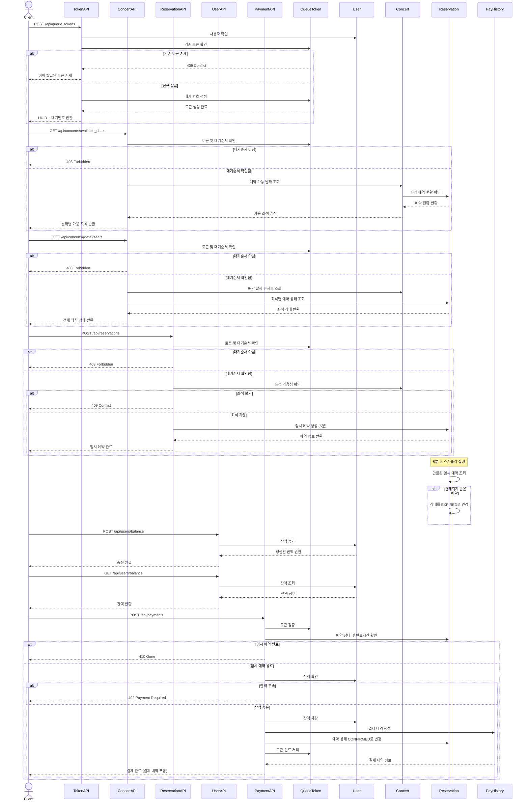

# 콘서트 예약 시스템 시퀀스 다이어그램

```mermaid
sequenceDiagram
    %% 참여자 정의
    actor Client
    participant TokenAPI
    participant ConcertAPI
    participant ReservationAPI
    participant UserAPI
    participant PaymentAPI
    participant QueueToken
    participant User
    participant Concert
    participant Reservation

    %% 1. 토큰 발급
    Client->>TokenAPI: POST /api/queue_tokens
    TokenAPI->>User: 사용자 확인
    TokenAPI->>QueueToken: 기존 토큰 확인
    alt 기존 토큰 존재
        QueueToken-->>TokenAPI: 409 Conflict
        TokenAPI-->>Client: 이미 발급된 토큰 존재
    else 신규 발급
        TokenAPI->>QueueToken: 대기 번호 생성
        QueueToken-->>TokenAPI: 토큰 생성 완료
        TokenAPI-->>Client: UUID + 대기번호 반환
    end

    %% 2-1. 날짜 조회
    Client->>ConcertAPI: GET /api/concerts/available_dates
    ConcertAPI->>QueueToken: 토큰 및 대기순서 확인
    alt 대기순서 아님
        ConcertAPI-->>Client: 403 Forbidden
    else 대기순서 확인됨
        ConcertAPI->>Concert: 예약 가능 날짜 조회
        Concert->>Reservation: 좌석 예약 현황 확인
        Reservation-->>Concert: 예약 현황 반환
        Concert-->>ConcertAPI: 가용 좌석 계산
        ConcertAPI-->>Client: 날짜별 가용 좌석 반환
    end

    %% 2-2. 좌석 조회
    Client->>ConcertAPI: GET /api/concerts/{date}/seats
    ConcertAPI->>QueueToken: 토큰 및 대기순서 확인
    alt 대기순서 아님
        ConcertAPI-->>Client: 403 Forbidden
    else 대기순서 확인됨
        ConcertAPI->>Concert: 해당 날짜 콘서트 조회
        ConcertAPI->>Reservation: 좌석별 예약 상태 조회
        Reservation-->>ConcertAPI: 좌석 상태 반환
        ConcertAPI-->>Client: 전체 좌석 상태 반환
    end

    %% 3. 좌석 예약
    Client->>ReservationAPI: POST /api/reservations
    ReservationAPI->>QueueToken: 토큰 및 대기순서 확인
    alt 대기순서 아님
        ReservationAPI-->>Client: 403 Forbidden
    else 대기순서 확인됨
        ReservationAPI->>Concert: 좌석 가용성 확인
        alt 좌석 불가
            ReservationAPI-->>Client: 409 Conflict
        else 좌석 가용
            ReservationAPI->>Reservation: 임시 예약 생성 (5분)
            Reservation-->>ReservationAPI: 예약 정보 반환
            ReservationAPI-->>Client: 임시 예약 완료
        end
    end

    %% 임시 예약 만료 처리
    Note over Reservation: 5분 후 스케줄러 실행
    Reservation->>Reservation: 만료된 임시 예약 조회
    alt 결제되지 않은 예약
        Reservation->>Reservation: 상태를 EXPIRED로 변경
    end

    %% 4-1. 잔액 충전
    Client->>UserAPI: POST /api/users/balance
    UserAPI->>User: 잔액 증가
    User-->>UserAPI: 갱신된 잔액 반환
    UserAPI-->>Client: 충전 완료

    %% 4-2. 잔액 조회
    Client->>UserAPI: GET /api/users/balance
    UserAPI->>User: 잔액 조회
    User-->>UserAPI: 잔액 정보
    UserAPI-->>Client: 잔액 반환

    %% 5. 결제
    Client->>PaymentAPI: POST /api/payments
    PaymentAPI->>QueueToken: 토큰 검증
    PaymentAPI->>Reservation: 예약 상태 및 만료시간 확인
    alt 임시 예약 만료
        PaymentAPI-->>Client: 410 Gone
    else 임시 예약 유효
        PaymentAPI->>User: 잔액 확인
        alt 잔액 부족
            PaymentAPI-->>Client: 402 Payment Required
        else 잔액 충분
            PaymentAPI->>User: 잔액 차감
            PaymentAPI->>PayHistory: 결제 내역 생성
            PaymentAPI->>Reservation: 예약 상태 CONFIRMED로 변경
            PaymentAPI->>QueueToken: 토큰 만료 처리
            PayHistory-->>PaymentAPI: 결제 내역 정보
            PaymentAPI-->>Client: 결제 완료 (결제 내역 포함)
        end
    end
```