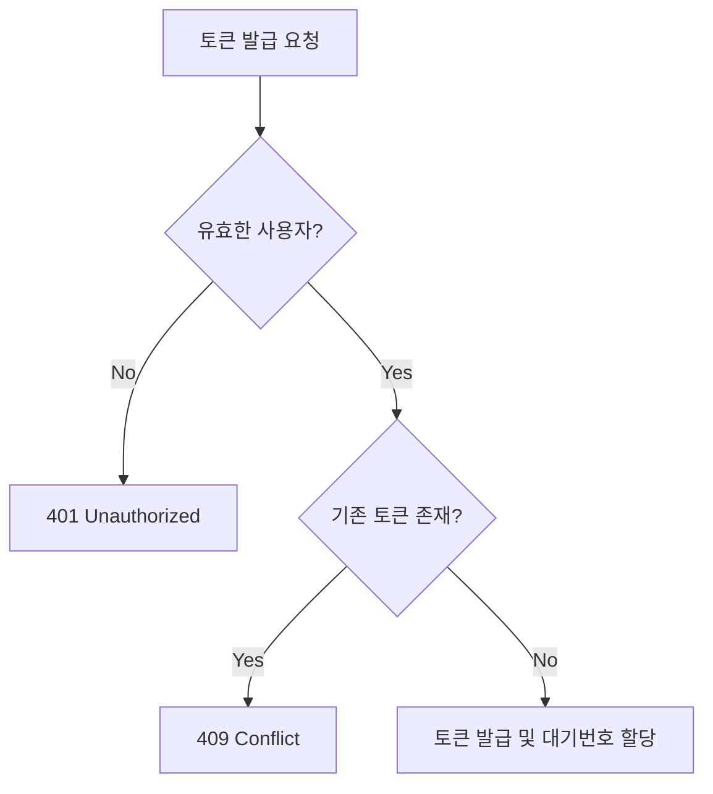

```mermaid
flowchart TD
    %% 1. 토큰 발급 API
    A1[토큰 발급 요청] --> B1{유효한 사용자?}
    B1 -->|No| C1[401 Unauthorized]
    B1 -->|Yes| D1{기존 토큰 존재?}
    D1 -->|Yes| E1[409 Conflict]
    D1 -->|No| F1[토큰 발급 및 대기번호 할당]
```