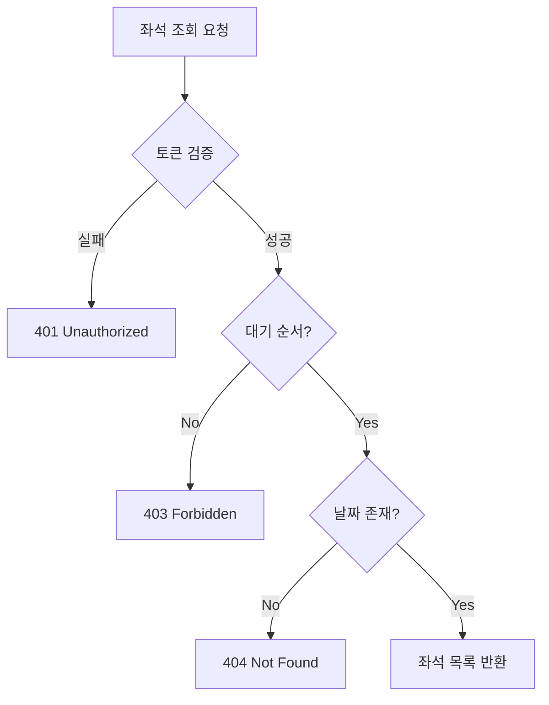

```mermaid
flowchart TD
    %% 2.2 좌석 조회 API
    A3[좌석 조회 요청] --> B3{토큰 검증}
    B3 -->|실패| C3[401 Unauthorized]
    B3 -->|성공| D3{대기 순서?}
    D3 -->|No| E3[403 Forbidden]
    D3 -->|Yes| F3{날짜 존재?}
    F3 -->|No| G3[404 Not Found]
    F3 -->|Yes| H3[좌석 목록 반환]
```