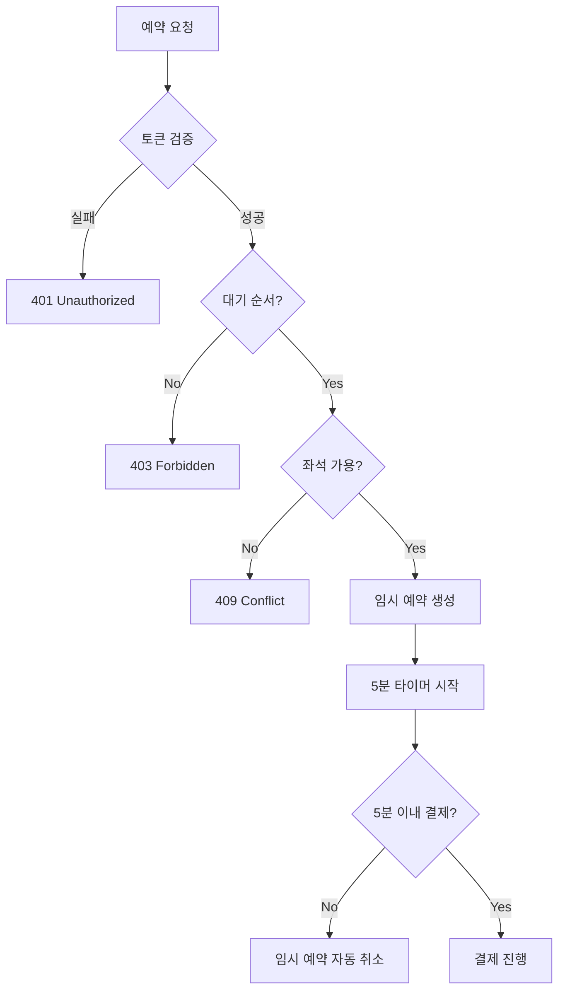

```mermaid
flowchart TD
    %% 3. 좌석 예약 API
    A4[예약 요청] --> B4{토큰 검증}
    B4 -->|실패| C4[401 Unauthorized]
    B4 -->|성공| D4{대기 순서?}
    D4 -->|No| E4[403 Forbidden]
    D4 -->|Yes| F4{좌석 가용?}
    F4 -->|No| G4[409 Conflict]
    F4 -->|Yes| H4[임시 예약 생성]
    H4 --> I4[5분 타이머 시작]
    I4 --> J4{5분 이내 결제?}
    J4 -->|No| K4[임시 예약 자동 취소]
    J4 -->|Yes| L4[결제 진행]
```