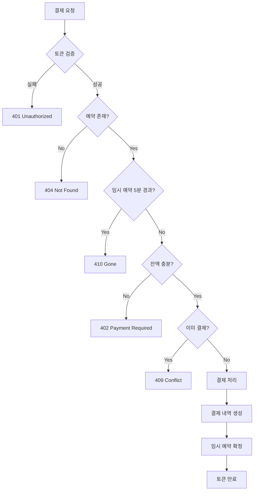

```mermaid
flowchart TD
    %% 5. 결제 API
    A7[결제 요청] --> B7{토큰 검증}
    B7 -->|실패| C7[401 Unauthorized]
    B7 -->|성공| D7{예약 존재?}
    D7 -->|No| E7[404 Not Found]
    D7 -->|Yes| F7{임시 예약 5분 경과?}
    F7 -->|Yes| G7[410 Gone]
    F7 -->|No| H7{잔액 충분?}
    H7 -->|No| I7[402 Payment Required]
    H7 -->|Yes| J7{이미 결제?}
    J7 -->|Yes| K7[409 Conflict]
    J7 -->|No| L7[결제 처리]
    L7 --> M7[결제 내역 생성]
    M7 --> N7[임시 예약 확정]
    N7 --> O7[토큰 만료]
```